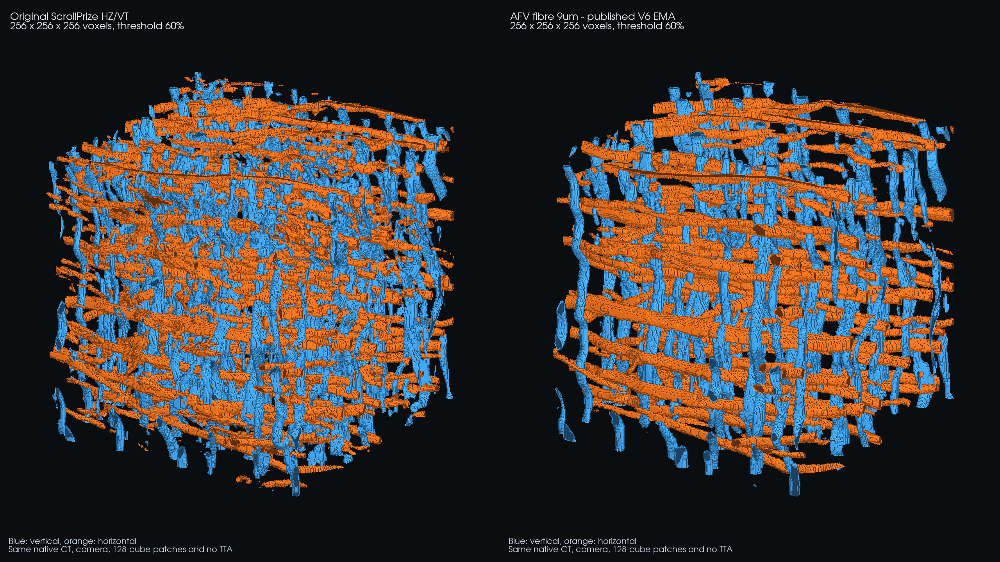

# AFV fibre model — original training code

Training code for [Qualzz20/afv_fiber_9um](https://huggingface.co/Qualzz20/afv_fiber_9um), fine-tuned from [scrollprize/fiber_hz_vt](https://huggingface.co/scrollprize/fiber_hz_vt) on native-grid CT around 9 µm.

The model was trained with automatically extracted fibre traces and conservative teacher-supported pseudo-labels, plus auxiliary centreline and local instance-affinity objectives. Compression augmentation transforms CT and labels together. The final phase uses a smooth deformation along the local sheet normal, closing voids before squeezing material in harder examples.

This repository contains the actual training core, recorded configurations, corpus manifests, validation manifests and available metrics from the successive initial, expanded-01 and V3–V6 phases. The 19 V3–V6 core source-file checks tracked by the run configurations match their recorded SHA-256 hashes. The six V6 files also match the configuration embedded in the final checkpoint. These files have been preserved unchanged; documentation and verification tools were added for publication.

## Matched 3D voxel comparison



**Left:** original ScrollPrize HZ/VT. **Right:** the published V6 EMA. Blue denotes vertical fibre predictions; orange denotes horizontal fibre predictions. Both use the same original CT cube, camera, 60% confidence threshold, 128³ inference windows, 64-voxel stride, Gaussian probability blending, BF16 precision and no test-time mirroring. Rendering uses categorical voxels without smoothing or MIP.

The 256³ cube is centred at native XYZ **(4032, 4060, 10913)** in PHerc0125, at **9.362 µm/voxel**. PHerc0125 is present in the training corpus; this is a qualitative illustration, not a held-out accuracy benchmark. [Comparison provenance](docs/COMPARISON.md).

## Start here

- [Training recipe and chronology](docs/TRAINING.md)
- [Data and pseudo-label construction](docs/DATA.md)
- [Local execution and dependencies](docs/RUNNING.md)
- Final trainer: [V6 train.py](original/fiber-centre-compression-v6/train.py)
- Final compaction: [V6 geometry.py](original/fiber-centre-compression-v6/geometry.py)
- Architecture and objectives: [V6 network.py](original/fiber-centre-compression-v6/network.py)
- Partial-label construction: [annotation.py](original/fiber-full-8000-v5/annotation.py)
- [Source inventory and recorded hashes](provenance/source-inventory.json)
- [Checkpoint/export verification](provenance/checkpoint-verification.json)

## What is released

The Hugging Face model is the **EMA segmentation backbone at recorded step 7624**, after 6750 additional optimizer updates in V6. All 1160 exported tensors were checked bit-for-bit against that EMA. The published checkpoint SHA-256 is `6837f3fe8fca123e6ed0b91bb052ce5218ca6eb6889800e4d578b6c8aaf59767`.

The final EMA was released; the run's lowest validation score occurred earlier at step 2624. That distinction and final cohort regressions are disclosed in the training recipe. The centreline and six affinity heads were training auxiliaries and are not included in the Hugging Face checkpoint. Class 3 had no positive fine-tuning targets and should not be relied on as a validated intersection output. The `nnUNetTrainer` metadata in the export provides compatibility with the inference loader; training used the custom loops included here.

## Scope and limitations

Machine orchestration, remote launchers, transfers, CT download/cache infrastructure and viewer code are deliberately excluded. The training loader still reads prepared local arrays and keeps a small working set in memory. Historical local file paths remain in the unchanged source and manifests; see the execution guide to remap them.

CT arrays, pseudo-label arrays, fixed validation volumes and intermediate checkpoints are not bundled. The manifests document the actual run, but rerunning it exactly requires those inputs and parent checkpoints. This is a source release for inspection and adaptation, not a one-command reconstruction of the original environment.

Labels are automatic and partial, not independent human anatomical ground truth. Compression is a geometric stress augmentation, not a calibrated mechanical simulation. Synthetic validation does not establish accuracy on real compressed fibres. Some added training regions used native-grid Volcomp q8 CT; native voxel spacing should not be confused with uncompressed CT provenance.

Verify the preserved sources without loading CT or using a GPU:

```bash
python tools/verify_sources.py
```

Run the original synthetic compaction checks with NumPy and SciPy:

```bash
python tools/check_compaction.py
```

Author's code is released under Apache-2.0. See [third-party attribution](THIRD_PARTY.md).

`release/README.md` is the unchanged historical Hugging Face model-card snapshot, retained for Git-blob verification. Its incomplete compression/intersection claims are superseded by the disclosures here and the current model card linked above. `docs/HF_MODEL_CARD_PROPOSED.md` preserves the revised card text.
